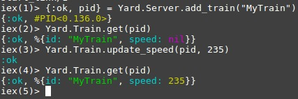

# Yard

## Why I've done this

I was just fascinated on how [`Supervisors`](https://hexdocs.pm/elixir/Supervisor.html) works on Elixir programming language, so I've decided to explore a little bit more about it!

## How it works?

`Yard` is just a module for controlling trains! I really use a lot of the subway service in São Paulo, so that was my inspiration.

You can just `git clone` the project, and run in the root `iex -S mix`, who will run the `Elixir's Interactive Shell` session with the Yard module used.
And there is no worries about dependencies, I write this in bare metal Elixir, no dependencies :sparkling_heart:! With `Elixir v1.7.2` and `Erlang v21.0`, you can really enjoy this features!

